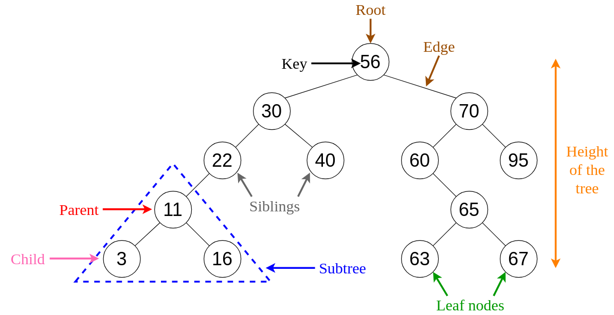
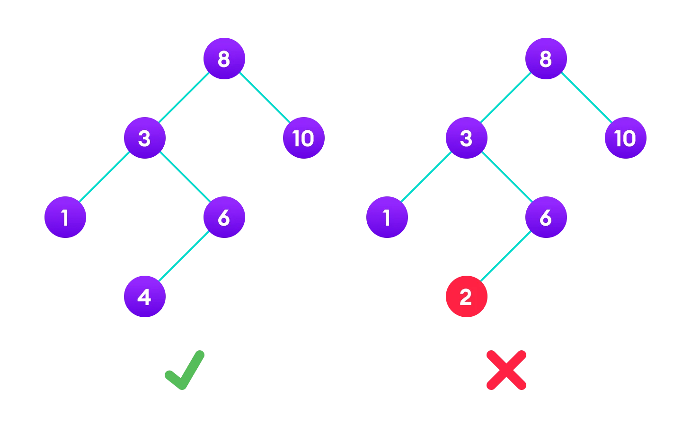

# Binary Search Tree

The idea is to use binary search which is a Divide and Conquer algorithm. Like all divide-and-conquer algorithms, binary search first divides a large array into two smaller subarrays and then recursively (or iteratively) operate the subarrays. But instead of working on both subarrays, it discards one subarray and continues on the second subarray. This decision of discarding one subarray is made in just one comparison.


## BST Structure







## Reference 

<iframe width="950" height="534" src="https://www.youtube.com/embed/-oYitelECuQ" title="Data Structures in Golang - Binary Search Tree" frameborder="0" allow="accelerometer; autoplay; clipboard-write; encrypted-media; gyroscope; picture-in-picture" allowfullscreen></iframe>


```python

class Node:
    def __init__(self, key):
        self.left = None
        self.right = None
        self.val = key

    # Traverse preorder
    def traversePreOrder(self):
        print(self.val, end=' ')
        if self.left:
            self.left.traversePreOrder()
        if self.right:
            self.right.traversePreOrder()

    # Traverse inorder
    def traverseInOrder(self):
        if self.left:
            self.left.traverseInOrder()
        print(self.val, end=' ')
        if self.right:
            self.right.traverseInOrder()

    # Traverse postorder
    def traversePostOrder(self):
        if self.left:
            self.left.traversePostOrder()
        if self.right:
            self.right.traversePostOrder()
        print(self.val, end=' ')


```


