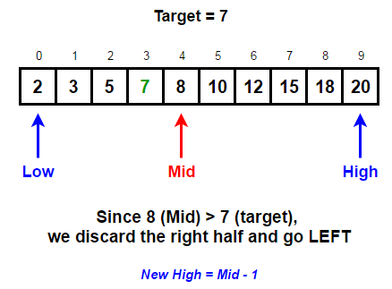
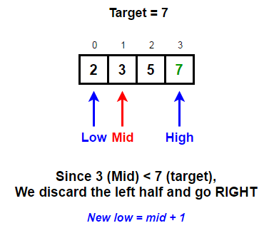
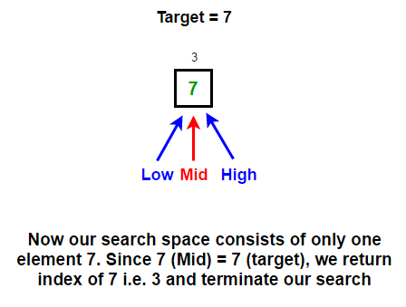

# Binary Search

The idea is to use binary search which is a Divide and Conquer algorithm. Like all divide-and-conquer algorithms, binary search first divides a large array into two smaller subarrays and then recursively (or iteratively) operate the subarrays. But instead of working on both subarrays, it discards one subarray and continues on the second subarray. This decision of discarding one subarray is made in just one comparison.


## Working of Binary Search

 
 



## Code Implementation

```go
package main

import "fmt"

func BinarySearch(arr []int, k int) (bool, int) {
	low := 0
	high := len(arr) - 1
	for low <= high {
		median := (low + high) / 2
		if arr[median] < k {
			low = median + 1
		} else {
			high = median - 1
		}
	}

	if low == len(arr) || arr[low] != k {
		return false, -1
	}

	return true, low

}

func main() {

	arr := []int{2, 3, 5, 7, 8, 10, 12, 15, 18, 20}
	fmt.Println(BinarySearch(arr, 7))
}

```