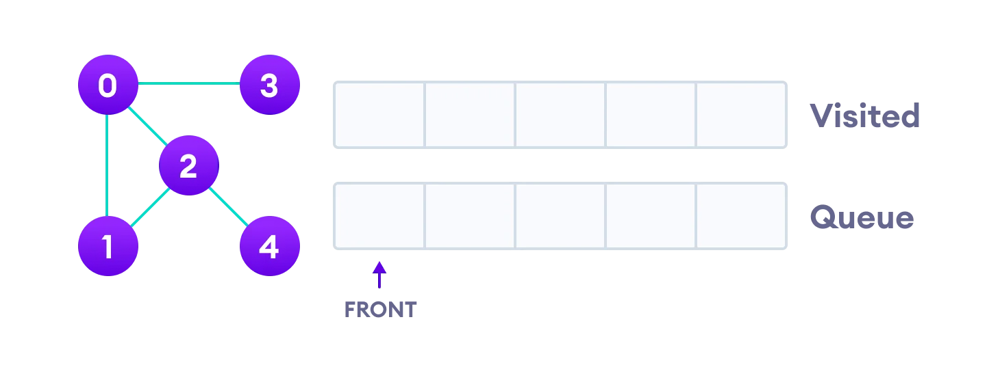
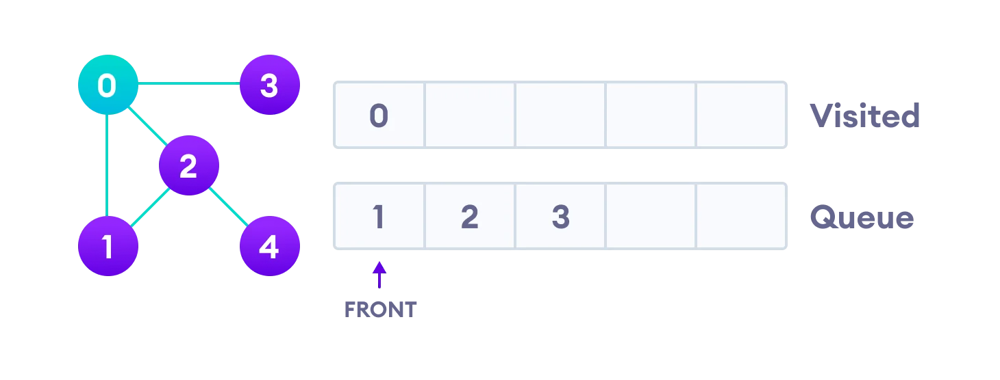
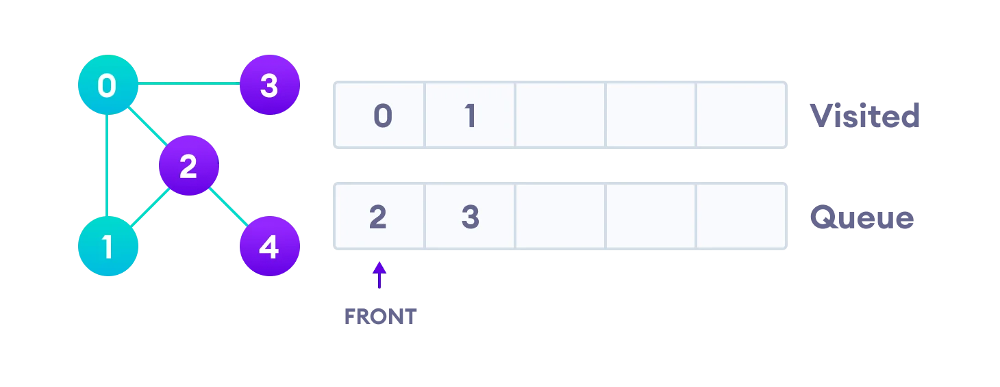
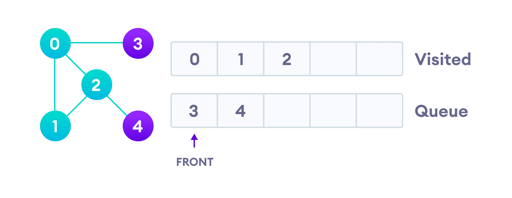
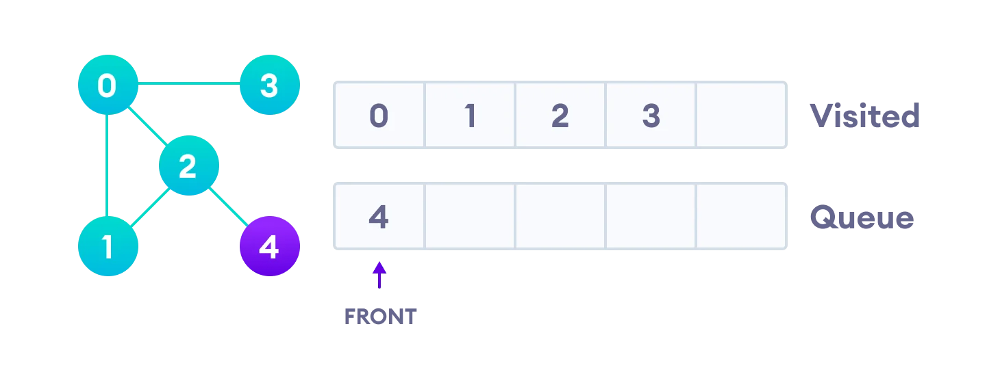
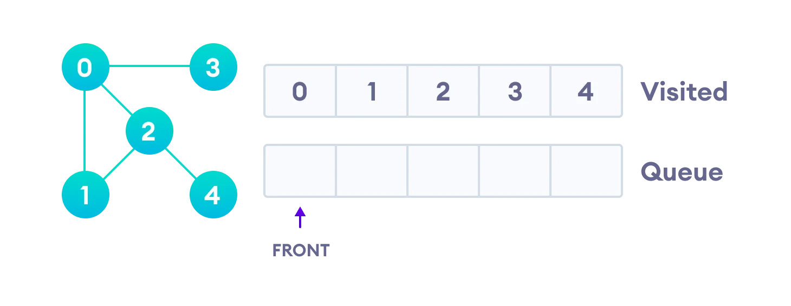

# Breadth First Search

Breadth–first search (BFS) is an algorithm for traversing or searching tree or graph data structures. It starts at the tree root (or some arbitrary node of a graph, sometimes referred to as a ‘search key’) and explores the neighbor nodes first before moving to the next-level neighbors.

## Explanation


Breadth–first search (BFS) is a graph traversal algorithm that explores vertices in the order of their distance from the source vertex, where distance is the minimum length of a path from the source vertex to the node as evident from the above example.

The time complexity of BFS traversal is O(V + E), where V and E are the total number of vertices and edges in the graph, respectively. Please note that O(E) may vary between O(1) and O(V2), depending on how dense the graph is.

Traversal means visiting all the nodes of a graph. Breadth First Traversal or Breadth First Search is a recursive algorithm for searching all the vertices of a graph or tree data structure.

## BFS algorithm

A standard BFS implementation puts each vertex of the graph into one of two categories:

1.  Visited
2.  Not Visited

The purpose of the algorithm is to mark each vertex as visited while avoiding cycles.

The algorithm works as follows:

1.  Start by putting any one of the graph's vertices at the back of a queue.
2.  Take the front item of the queue and add it to the visited list.
3.  Create a list of that vertex's adjacent nodes. Add the ones which aren't in the visited list to the back of the queue.
4.  Keep repeating steps 2 and 3 until the queue is empty.

The graph might have two different disconnected parts so to make sure that we cover every vertex, we can also run the BFS algorithm on every node

## BFS example

- Let's see how the Breadth First Search algorithm works with an example. We use an undirected graph with 5 vertices.



> Undirected graph with 5 vertices

We start from vertex 0, the BFS algorithm starts by putting it in the Visited list and putting all its adjacent vertices in the stack.



> Visit start vertex and add its adjacent vertices to queue

Next, we visit the element at the front of queue i.e. 1 and go to its adjacent nodes. Since 0 has already been visited, we visit 2 instead.



> Visit the first neighbour of start node 0, which is 1

Vertex 2 has an unvisited adjacent vertex in 4, so we add that to the back of the queue and visit 3, which is at the front of the queue.



> Visit 2 which was added to queue earlier to add its neighbours



> 4 remains in the queue

Only 4 remains in the queue since the only adjacent node of 3 i.e. 0 is already visited. We visit it.



> Visit last remaining item in the queue to check if it has unvisited neighbors

Since the queue is empty, we have completed the Breadth First Traversal of the graph.

## BFS pseudocode

```
create a queue Q
mark v as visited and put v into Q
while Q is non-empty
    remove the head u of Q
    mark and enqueue all (unvisited) neighbours of u
```

## BFS Algorithm Complexity

The time complexity of the BFS algorithm is represented in the form of `O(V + E)`, where V is the number of nodes and E is the number of edges.

The space complexity of the algorithm is `O(V)`.

## BFS Algorithm Applications

1.  To build index by search index
2.  For GPS navigation
3.  Path finding algorithms
4.  In Ford-Fulkerson algorithm to find maximum flow in a network
5.  Cycle detection in an undirected graph

## Code Implementation

```go
// Breadth First Search in Go

package main

import "fmt"

func BreadthFirstSearch(start, end, nodes int, edges [][]int) (isConnected bool, distance int) {
	queue := make([]int, 0)
	visited := make([]int, nodes)
	visited[start] = 1
	queue = append(queue, start)

	for len(queue) > 0 {
		v := queue[0]
		queue = queue[1:]
		for i := 0; i < len(edges[v]); i++ {
			if visited[i] == 0 && edges[v][i] > 0 {
				if i == end {
					return true, visited[v]
				}
				visited[i] = visited[v] + 1
				queue = append(queue, i)
			}
		}
	}

	return false, 0
}

func main() {
	fmt.Println(BreadthFirstSearch(0,
		5,
		6,
		[][]int{
			{0, 1, 1, 0, 0, 0},
			{1, 0, 0, 1, 0, 1},
			{1, 0, 0, 1, 0, 0},
			{0, 1, 1, 0, 1, 0},
			{0, 0, 0, 1, 0, 0},
			{0, 1, 0, 0, 0, 0},
		}))
}

```

## Reference

<iframe width="950" height="534" src="https://www.youtube.com/embed/oDqjPvD54Ss" title="Breadth First Search Algorithm | Shortest Path | Graph Theory" frameborder="0" allow="accelerometer; autoplay; clipboard-write; encrypted-media; gyroscope; picture-in-picture" allowfullscreen></iframe>
