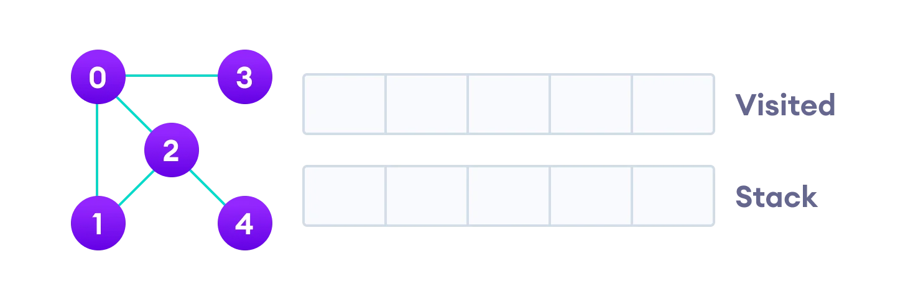
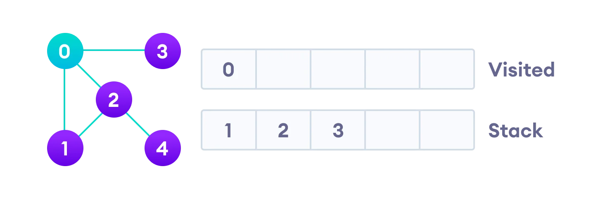
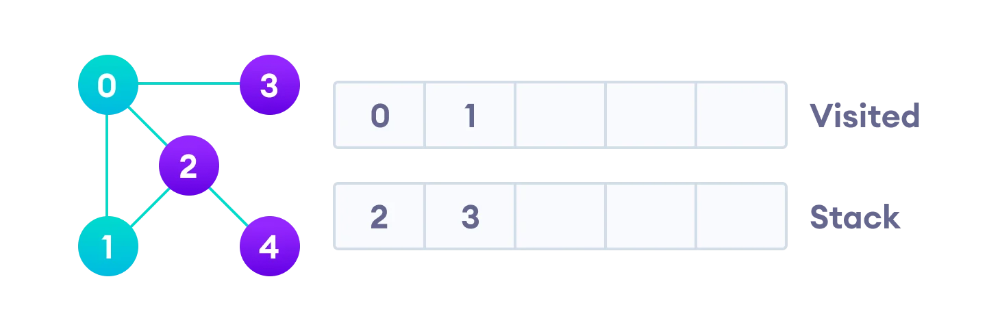
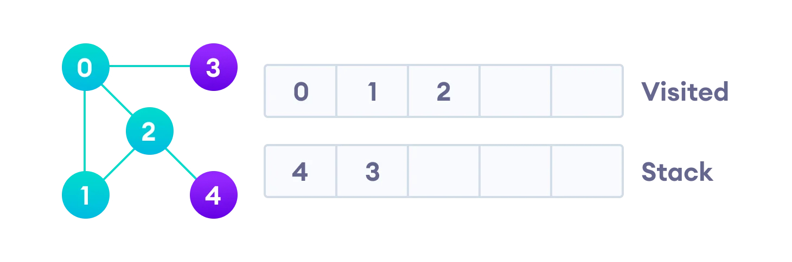
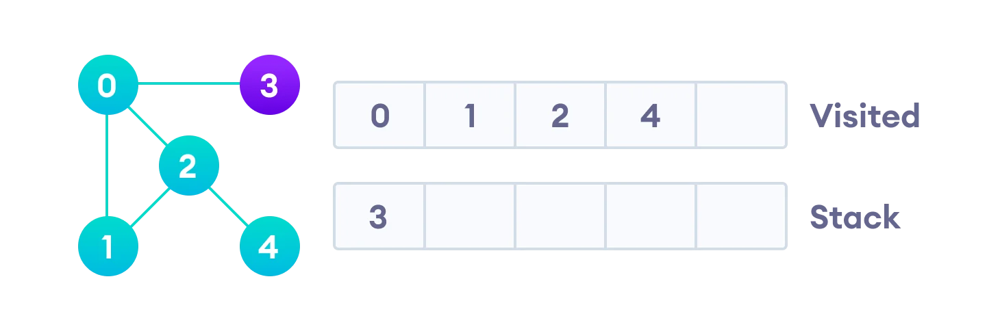
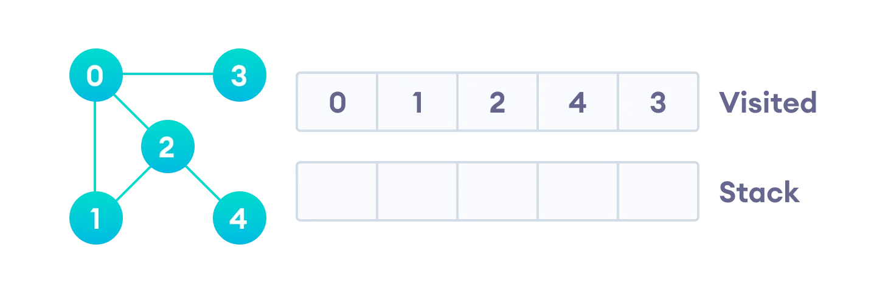

# Depth First Search

Depth–first search (DFS) is an algorithm for traversing or searching tree or graph data structures. One starts at the root (selecting some arbitrary node as the root for a graph) and explore as far as possible along each branch before backtracking.


Depth first Search or Depth first traversal is a recursive algorithm for searching all the vertices of a graph or tree data structure. Traversal means visiting all the nodes of a graph.


## Depth First Search Algorithm


A standard DFS implementation puts each vertex of the graph into one of two categories:

1.  Visited
2.  Not Visited

The purpose of the algorithm is to mark each vertex as visited while avoiding cycles.

The DFS algorithm works as follows:

1.  Start by putting any one of the graph's vertices on top of a stack.
2.  Take the top item of the stack and add it to the visited list.
3.  Create a list of that vertex's adjacent nodes. Add the ones which aren't in the visited list to the top of the stack.
4.  Keep repeating steps 2 and 3 until the stack is empty.


## Depth First Search Example

- Let's see how the Depth First Search algorithm works with an example. We use an undirected graph with 5 vertices.



> Undirected graph with 5 vertices

- We start from vertex 0, the DFS algorithm starts by putting it in the Visited list and putting all its adjacent vertices in the stack.



> Visit the element and put it in the visited list

- Next, we visit the element at the top of stack i.e. 1 and go to its adjacent nodes. Since 0 has already been visited, we visit 2 instead.



> Visit the element at the top of stack


- Vertex 2 has an unvisited adjacent vertex in 4, so we add that to the top of the stack and visit it.



> Vertex 2 has an unvisited adjacent vertex in 4, so we add that to the top of the stack and visit it.



> Vertex 2 has an unvisited adjacent vertex in 4, so we add that to the top of the stack and visit it.

- After we visit the last element 3, it doesn't have any unvisited adjacent nodes, so we have completed the Depth First Traversal of the graph.



> After we visit the last element 3, it doesn't have any unvisited adjacent nodes, so we have completed the Depth First Traversal of the graph.


## DFS Pseudocode (recursive implementation)

The pseudocode for DFS is shown below. In the init() function, notice that we run the DFS function on every node. This is because the graph might have two different disconnected parts so to make sure that we cover every vertex, we can also run the DFS algorithm on every node.

```
DFS(G, u)
    u.visited = true
    for each v ∈ G.Adj\[u\]
        if v.visited == false
            DFS(G,v)
     
init() {
    For each u ∈ G
        u.visited = false
     For each u ∈ G
       DFS(G, u)
}
```


## Complexity of Depth First Search

The time complexity of the DFS algorithm is represented in the form of `O(V + E)`, where `V` is the number of nodes and `E` is the number of edges.

The space complexity of the algorithm is `O(V)`.


## Application of DFS Algorithm

1.  For finding the path
2.  To test if the graph is bipartite
3.  For finding the strongly connected components of a graph
4.  For detecting cycles in a graph


<iframe width="950" height="534" src="https://www.youtube.com/embed/7fujbpJ0LB4?list=PLDV1Zeh2NRsDGO4--qE8yH72HFL1Km93P" title="Depth First Search Algorithm | Graph Theory" frameborder="0" allow="accelerometer; autoplay; clipboard-write; encrypted-media; gyroscope; picture-in-picture" allowfullscreen></iframe>