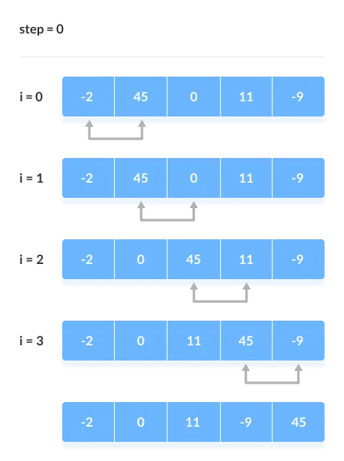
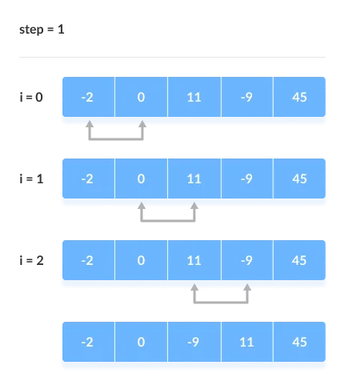
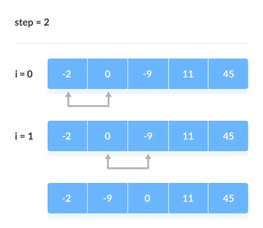
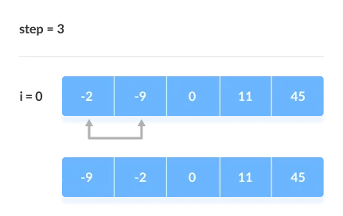

# Bubble Sort

# Bubble Sort

In this tutorial, you will learn about the bubble sort algorithm and its implementation in Python, Java, C, and C++.

**Bubble sort** is a sorting algorithm that compares two adjacent elements and swaps them until they are not in the intended order.

Just like the movement of air bubbles in the water that rise up to the surface, each element of the array move to the end in each iteration. Therefore, it is called a bubble sort.


## Working of Bubble Sort


Suppose we are trying to sort the elements in **ascending order**.

**1\. First Iteration (Compare and Swap)**

1.  Starting from the first index, compare the first and the second elements.
2.  If the first element is greater than the second element, they are swapped.
3.  Now, compare the second and the third elements. Swap them if they are not in order.
4.  The above process goes on until the last element.
    
   
    
    Compare the Adjacent Elements
    

**2\. Remaining Iteration**

The same process goes on for the remaining iterations.

After each iteration, the largest element among the unsorted elements is placed at the end.



Put the largest element at the end

In each iteration, the comparison takes place up to the last unsorted element.



Compare the adjacent elements

The array is sorted when all the unsorted elements are placed at their correct positions.



The array is sorted if all elements are kept in the right order


## Bubble Sort Algorithm


  ```js
  bubbleSort(array)
      for i <- 1 to indexOfLastUnsortedElement-1
        if leftElement > rightElement
          swap leftElement and rightElement
    end bubbleSort
```


## Optimized Bubble Sort Algorithm

In the above algorithm, all the comparisons are made even if the array is already sorted.

This increases the execution time.

#div-gpt-ad-Programizcom37046 {display:none; width: 728px; height: 90px; } #div-gpt-ad-Programizcom36796 {display: block;} @media(min-width: 992px) { #div-gpt-ad-Programizcom37046 {display: block;} #div-gpt-ad-Programizcom36796 {display: none;}}

To solve this, we can introduce an extra variable swapped. The value of swapped is set true if there occurs swapping of elements. Otherwise, it is set **false**.

After an iteration, if there is no swapping, the value of swapped will be **false**. This means elements are already sorted and there is no need to perform further iterations.

This will reduce the execution time and helps to optimize the bubble sort.

**Algorithm for optimized bubble sort is**

```js   
   bubbleSort(array)
      swapped <- false
      for i <- 1 to indexOfLastUnsortedElement-1
        if leftElement > rightElement
          swap leftElement and rightElement
          swapped <- true
    end bubbleSort
```


## Bubble Sort Complexity

**Time Complexity**

 

Best

O(n)

Worst

O(n2)

Average

O(n2)

**Space Complexity**

O(1)

**Stability**

Yes


### Complexity in Detail

Bubble Sort compares the adjacent elements.

Cycle

Number of Comparisons

1st

(n-1)

2nd

(n-2)

3rd

(n-3)

.......

......

last

1

Hence, the number of comparisons is

    (n-1) + (n-2) + (n-3) +.....+ 1 = n(n-1)/2

nearly equals to `n2`

Hence, **Complexity:** O(n2)

Also, if we observe the code, bubble sort requires two loops. Hence, the complexity is `n*n = n2`

### 1\. Time Complexities

*   **Worst Case Complexity:** `O(n2)`  
    If we want to sort in ascending order and the array is in descending order then the worst case occurs.
*   **Best Case Complexity:** `O(n)`  
    If the array is already sorted, then there is no need for sorting.
*   **Average Case Complexity:** `O(n2)`  
    It occurs when the elements of the array are in jumbled order (neither ascending nor descending).

### 2\. Space Complexity

*   Space complexity is `O(1)` because an extra variable is used for swapping.
*   In the **optimized bubble sort algorithm**, two extra variables are used. Hence, the space complexity will be `O(2)`.


## Bubble Sort Applications

Bubble sort is used if

*   complexity does not matter
*   short and simple code is preferred


## Code Implementation

```go
package main

func BubbleSort(array []int) []int {
    for i:=0;i<len(array);i++{
        for j:=0;j<len(array)-1;j++{
            if array[i] < array[j] {
                temp := array[j]
                array[j] = array[i]
                array[i] = temp
            }
        }
    }
    return array 
}


```