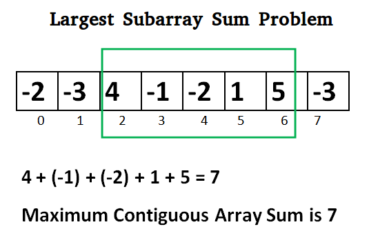

# Kadane’s Algorithm

Kadane's Algorithm is an iterative dynamic programming algorithm ( A method that is often used to solve finite-dimensional nonlinear constrained global optimal control problems ), so to understand Kadane's Algorithm we need to understand Dynamic Programming first. Kadane's Algorithm is used to solve the famous problem - Maximum Subarray Sum. This Algorithm is used to solve the problem in linear time.




## Working of the Algorithm
In Kadane's Algorithm, we look for all positive contiguous subarrays of the array, keeping track of the global maximum sum which will be the array. Whenever we get a positive-subarray-sum, we compare it with the global_max and update global_max if the sum is greater than the global_max, and whenever we get a negative-subarray-sum, we have to reset the sum to zero, because we will never take that element for the next subarrays.

- Initialize: local_max = 0 global_max = INT_MIN

- For each element we will follow these steps:

  - local_max = local_max + a[i]
  - if (local_max > global_max ) set global_max = local_max
  - if (local_max < 0) set local_max = 0
  - global_max is the maximum sum required.

- Lets understand the above algorithm using an example.

  - Let the array be: [2, -4, 3, -1, 2]
  
  - at first, local_max = global_max = 0
   
  - Now, lets loop through each element.
   
  - when i=0, a[0]= 2: local_max = local_max + 2 = 2. since, local_max is greater than global_max, so set global_max = 2.
   
  - when i=1, a[1]= -4: local_max = local_max + (-4) = 2+(-4) = -2 since local_max < 0, we wll set local_max to 0. but, global_max is still 2.
   
  - when i=2, a[2]= 3: local_max = local_max + (3) = 0+3 = 3 since local_max(= 3) > global_max(= 2) so we will set global_max = 3.
   
  - when i=3, a[3]= -1 local_max = local_max + (-1) = 3+(-1) = 2 global_max is still greater than local_max, so no update will be done here, i.e. global_max = 2
   
  - when i=4, a[4]= 2 local_max = local_max + 2 = 2+2 = 4 since local_max(= 4) > global_max(= 2), we will set global_max = 4.
   
  - Thus we get the maximum subarray sum as 4


## Code Implementation

```go
import "math"
func maxSubArray(nums []int) int {    
    maxSum := math.MinInt
    
    curSum := 0
    
    for i:=0;i<len(nums);i++{
        curSum += nums[i]
        
        if curSum > maxSum {
            maxSum = curSum
        }
        
        if curSum < 0 {
            curSum = 0
        }
        
    }
    
    return maxSum
}

// [-2,1,-3,4,-1,2,1,-5,4]go

```