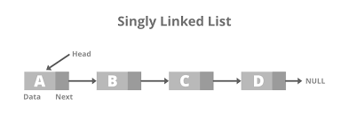
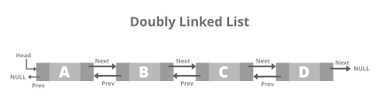
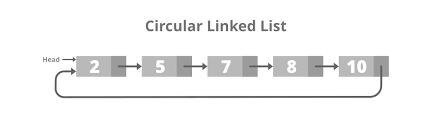

# Linked Lists

## Key Terms
### Singly Linked List

A data structure that consists of nodes, each with some value and a pointer to the next node in the linked list. A linked list node's value and
next node are typically stored in `value` and `next` properties, respectively.

The first node in a linked list is referred to as the **head** of the linked list, while the last node in a linked list, whose `next` property points to
the `null` value, is known as the **tail** of the linked list.

Below is a visual representation of a singly linked list whose nodes hold integer values:

```
0 -> 1 -> 2 -> 3 -> 4 -> 5 -> null
```

A singly linked list typically exposes its head to its user for easy access. While finding a node in a singly linked list involves traversing through
all of the nodes leading up to the node in question (as opposed to instant access with an array), adding or removing nodes simply involves
overwriting `next` pointers (assuming that you have access to the node right before the node that you're adding or removing).

The following are a singly linked list's standard operations and their corresponding time complexities:

* Accessing the head: O(1)
* Accessing the tail: O(n)
* Accessing a middle node: O(n)
* Inserting / Removing the head: O(1)
* Inserting / Removing the tail: O(n) to access + O(1)
* Inserting / Removing a middle node: O(n) to access + O(1)
* Searching for a value: O(n)



### Doubly Linked List

Similar to a **singly linked list**, except that each node in a doubly linked list also has a pointer to the previous node in the linked list. The
previous node is typically stored in a `prev` property.


Just as the `next` property of a doubly linked list's tail points to the `null` value, so too does the `prev` property of a doubly linked list's
**head**.

Below is a visual representation of a doubly linked list whose nodes hold integer values:

```
null <- 0 <-> 1 <-> 2 <-> 3 <-> 4 <-> 5 -> null
```

While a doubly linked list typically exposes both its head and tail to its user, as opposed to just its head in the case of a singly linked list, it
otherwise behaves very similarly to a singly linked list.

The following are a doubly linked list's standard operations and their corresponding time complexities:

* Accessing the head: O(1)
* Accessing the tail: O(1)
* Accessing a middle node: O(n)
* Inserting / Removing the head: O(1)
* Inserting / Removing the tail: O(1)
* Inserting / Removing a middle node: O(n) to access + O(1)
* Searching for a value: O(n)



### Circular Linked List
A linked list that has no clear **head** or **tail**, because its "tail" points to its "head," effectively forming a closed circle. A Circular linked list can be either a **singly circular linked list** or a **double circular linked list.**





## Code Implementation

### Single Linked List

```go
package main

import "fmt"

type LinkedList struct {
	Value int
	Next  *LinkedList
}

func parseIndex(index []int) int {
	if len(index) == 1 {
		return index[0]
	}
	return 0
}

func main() {
	list := createLinkedList([]int{17, 20, 4, 8, 23, 57})
	list.insertIntoList(3, 10)
	list.updateAtList(0, 100)
	list.deleteAtList(3)
	list.printList()
	fmt.Println(list.search(20))
}

func (l *LinkedList) printList() {
	fmt.Print(l.Value, " ")
	if l.Next != nil {
		l.Next.printList()
	} else {
		fmt.Println()
	}
}

func createLinkedList(arr []int) *LinkedList {
	if len(arr) < 3 {
		panic("At least two values are required")
	}
	head := LinkedList{
		Value: arr[0],
		Next:  nil,
	}
	i := 1
	makeList(&head, i, arr)
	return &head
}

func makeList(currList *LinkedList, index int, arr []int) error {
	if index == len(arr) {
		return nil
	}
	nextList := LinkedList{
		Value: arr[index],
		Next:  nil,
	}
	currList.Next = &nextList
	index++
	return makeList(&nextList, index, arr)
}

func (list *LinkedList) insertIntoList(insertPos int, value int, index ...int) {
	i := parseIndex(index)
	if insertPos == i {
		temp := LinkedList{
			Value: list.Value,
			Next:  list.Next,
		}
		list.Value = value
		list.Next = &temp
		return
	}
	i++
	list.Next.insertIntoList(insertPos, value, i)
}

func (list *LinkedList) deleteAtList(deletePos int, index ...int) {
	i := parseIndex(index)
	if i == deletePos-1 {
		list.Next = list.Next.Next
		return
	}
	i++
	list.Next.deleteAtList(deletePos, i)
}

func (list *LinkedList) updateAtList(updatePos int, value int, index ...int) {
	i := parseIndex(index)
	if i == updatePos {
		list.Value = value
		return
	}
	i++
	list.Next.updateAtList(updatePos, value, i)
}

func (list *LinkedList) search(value int, index ...int) int {
	i := parseIndex(index)
	if list.Value == value {
		return i
	}
	i++
	return list.Next.search(value, i)
}


```

### doubly linked list

```go

package main

import "fmt"

type LinkedList struct {
	Value int
	Prev  *LinkedList
	Next  *LinkedList
}

func parseIndex(index []int) int {
	if len(index) == 1 {
		return index[0]
	}
	return 0
}

func main() {
	list := createLinkedList([]int{17, 20, 4, 8, 23, 57})
	list.insertIntoList(3, 10)
	list.updateAtList(0, 100)
	list.deleteAtList(3)
	list.printList()
	fmt.Println(list.isHead(), list.isTail(), list.search(57))
}

func (l *LinkedList) printList() {
	fmt.Print(l.Value, " ")
	if l.Next != nil {
		l.Next.printList()
	} else {
		fmt.Println()
	}
}

func createLinkedList(arr []int) *LinkedList {
	if len(arr) < 3 {
		panic("At least two values are required")
	}
	head := LinkedList{
		Value: arr[0],
		Prev:  nil,
		Next:  nil,
	}
	i := 1
	makeList(&head, i, arr)
	return &head
}

func makeList(currList *LinkedList, index int, arr []int) error {
	if index == len(arr) {
		return nil
	}
	nextList := LinkedList{
		Prev:  currList,
		Value: arr[index],
		Next:  nil,
	}
	currList.Next = &nextList
	index++
	return makeList(&nextList, index, arr)
}

func (list *LinkedList) insertIntoList(insertPos int, value int, index ...int) {
	i := parseIndex(index)
	if insertPos == i {
		temp := LinkedList{
			Value: list.Value,
			Next:  list.Next,
		}
		list.Value = value
		list.Next = &temp
		return
	}
	i++
	list.Next.insertIntoList(insertPos, value, i)
}

func (list *LinkedList) deleteAtList(deletePos int, index ...int) {
	i := parseIndex(index)
	if i == deletePos-1 {
		list.Next = list.Next.Next
		return
	}
	i++
	list.Next.deleteAtList(deletePos, i)
}

func (list *LinkedList) updateAtList(updatePos int, value int, index ...int) {
	i := parseIndex(index)
	if i == updatePos {
		list.Value = value
		return
	}
	i++
	list.Next.updateAtList(updatePos, value, i)
}

func (list *LinkedList) search(value int, index ...int) int {
	i := parseIndex(index)
	if list.Value == value {
		return i
	}
	i++
	return list.Next.search(value, i)
}

func (list *LinkedList) prevValue() *LinkedList {
	return list.Prev
}

func (list *LinkedList) isHead() bool {
	if list.Prev == nil {
		return true
	}
	return false
}

func (list *LinkedList) isTail() bool {
	if list.Next == nil {
		return true
	}
	return false
}


```