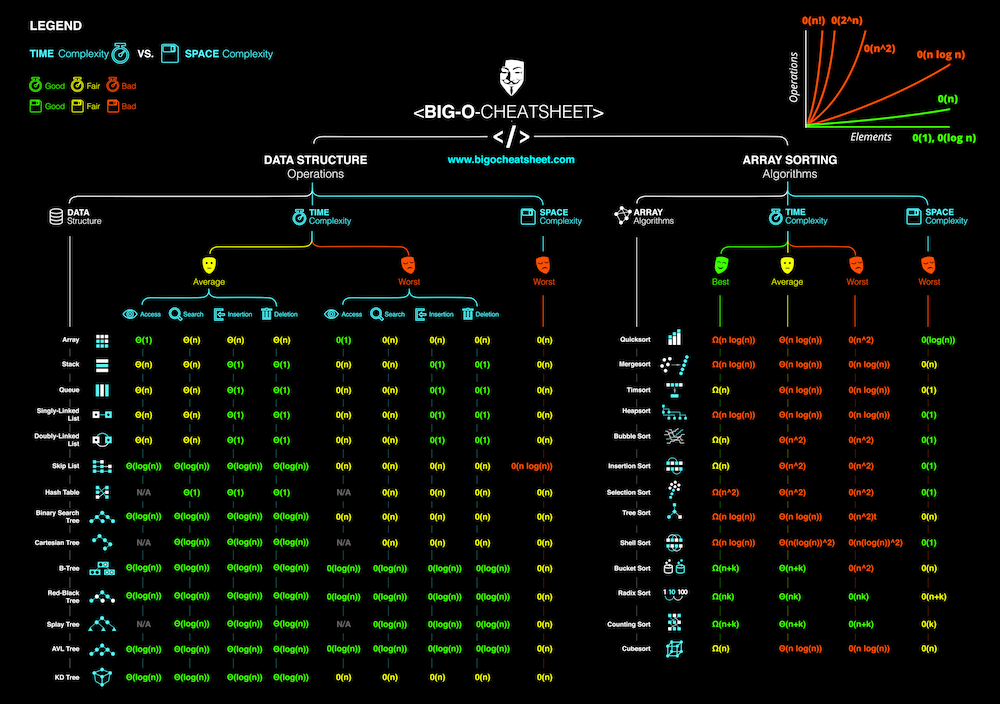

# Logarithm

## Key Terms
### Logarithm

A mathematical concept that's widely used in Computer Science and that's defined by the following equation:

> **logb(x) = y if and only if b<sup>y</sup>= x**

In the context of coding interviews, the logarithm is used to describe the complexity analysis of algorithms, and its usage always implies a
logarithm of base 2. In other words, the logarithm used in the context of coding interviews is defined by the following equation:

> **log(n) = y if and only if 2<sup>y</sup> = n**

In plain English, if an algorithm has a logarithmic time complexity (O(log(n)), where n is the size of the input), then whenever the algorithm's
input doubles in size (i.e., whenever n doubles), the number of operations needed to complete the algorithm only increases by one unit.
Conversely, an algorithm with a linear time complexity would see its number of operations double if its input size doubled.
As an example, a linear-time-complexity algorithm with an input of size 1,000 might take roughly 1,000 operations to complete, whereas a **logarithmic-time-complexity** alogrithm with the same input would take roughly 10 operations to complete, **since 2<sup>10</sup> ~= 1000**

## Examples for equation

### y = 0
```
log(n) = y 

log(1) = 0 
```

### y = 1
```
log(n) = y 

log(2) = 1
```

### y = 2

```
log(n) = y

log(4) = 2
```

## Notes

- When we double a number its power increases by 2 
```
2^4 = 2^3 * 2


2^4 = 16
2^5 = 32
```

- The more n increases the exponent increases by tiny amout, which means
```
in eq 

log(n) = y

if we increase y by a double value n only increase by 1
```

- Alogrithms having log(n) time complexity is a good thing
- log(n) < O(n)


## Coding Examples

```

[0,1,2,3,4,5,6,7]

- first cut
[0,1,2,3 | 4,5,6,7]

- second cut
[0,1 | 2,3 | 4,5,6,7]

- thrid cut
[0 | 1 | 2,3 | 4,5,6,7]

the reason is we are cutting array in half 3 times
log(8) = 3

```

## CheatSheet


