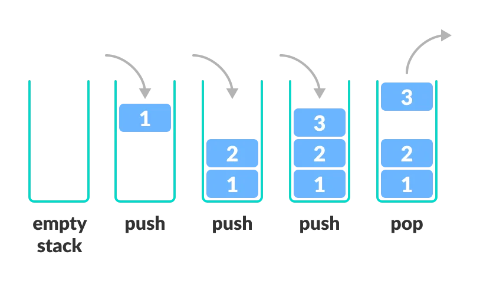
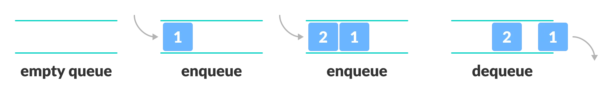

# Stacks And Queues

## Key Terms

### Stack
An array-like data structure whose elements follow the **LIFO rule: Last In, First Out.**

A stack is often compared to a stack of books on a table: the last book that's placed on the stack of books is the first one that's taken off the
stack.

The following are a stack's standard operations and their corresponding time complexities:

* Pushing an element onto the stack: O(1)
* Popping an element off the stack: O(1)
* Peeking at the element on the top of the stack: O(1)
* Searching for an element in the stack: O(n)

A stack is typically implemented with a **dynamic array** or with a **singly linked list.**




### Queue
An array-like data structure whose elements follow the **FIFO rule: First In, First Out.**

A queue is often compared to a group of people standing in line to purchase items at a store: the first person to get in line is the first one to
purchase items and to get out of the queue.

The following are a queue's standard operations and their corresponding time complexities:

* Enqueuing an element into the queue: O(1)
* Dequeuing an element out of the queue: O(1)
* Peeking at the element at the front of the queue: O(1)
* Searching for an element in the queue: O(n)


A queue is typically implemented with a **doubly linked list.**




## Code Implementation

### Stack 

```go
package main

import "fmt"

type Stack []int

func main() {
	var s Stack = []int{}
	s.Push(10)
	s.Push(1)
	s.Push(42)
	s.Push(17)
	s.Push(8)

	for len(s) > 0 {
		x, y := s.Pop()
		if y == true {
			fmt.Println(x)
		}
	}

}

// Push a new value onto the stack
func (s *Stack) Push(str int) {
	*s = append(*s, str) // Simply append the new value to the end of the stack
}

// Remove and return top element of stack. Return false if stack is empty.
func (s *Stack) Pop() (int, bool) {
	if s.IsEmpty() {
		return -1, false
	} else {
		index := len(*s) - 1   // Get the index of the top most element.
		element := (*s)[index] // Index into the slice and obtain the element.
		*s = (*s)[:index]      // Remove it from the stack by slicing it off.
		return element, true
	}
}

// IsEmpty: check if stack is empty
func (s *Stack) IsEmpty() bool {
	return len(*s) == 0
}


```


### Queue

```go
package main

import "fmt"

type Queue []int

func main() {
	var s Queue = []int{}
	s.Push(10)
	s.Push(1)
	s.Push(42)
	s.Push(17)
	s.Push(8)

	for len(s) > 0 {
		x, y := s.Pop()
		if y == true {
			fmt.Println(x)
		}
	}

}

// Push a new value onto the queue
func (s *Queue) Push(str int) {
	*s = append(*s, str) // Simply append the new value to the end of the Queue
}

// Remove and return top element of Queue. Return false if Queue is empty.
func (s *Queue) Pop() (int, bool) {
	if s.IsEmpty() {
		return -1, false
	} else {
		element := (*s)[0] // Index into the slice and obtain the element.
		*s = (*s)[1:]      // Remove it from the Queue by slicing it off.
		return element, true
	}
}

// IsEmpty: check if Queue is empty
func (s *Queue) IsEmpty() bool {
	return len(*s) == 0
}

```