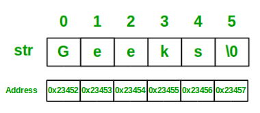

# Strings

## Key Terms
### String
One of the fundamental data types in Computer Science, strings are stored in **memory** as **arrays** of integers, where each character in a given
string is mapped to an integer via some character-encoding standard like **ASCII**.

Strings behave much like normal arrays, with the main distinction being that, in most programming languages (C++ is a notable exception),
strings are **immutable**, meaning that they can't be edited after creation. This also means that simple operations like appending a character to
a string are more expensive than they might appear.

The canonical example of an operation that's deceptively expensive due to string immutability is the following:

```js
 string = "this is a string"
 newString = ""
 for character in string:
  newString += character
```

The operation above has a time complexity of **O(n<sup>2</sup>
)** where n is the length of **string** , because each addition of a character to `newString`
creates an entirely new string and is itself an **O(n)** operation. Therefore, n O(n) operations are performed, leading to an O(n<sup>2</sup>
) time-complexity
operation overall.





## Code Implementation

```go
package main

import "fmt"

type String []rune

func main() {
	var s String = []rune("rahul")
	fmt.Println(s.indexOf("a"))
	fmt.Println(s.compare("rahul"))
}

func (s *String) indexOf(f string) int {
	for index, val := range *s {
		if string(rune(val)) == f {
			return index
		}
	}
	return -1
}

func (s *String) compare(sub string) bool {
	if len(*s) != len(sub) {
		return false
	}
	for index, val := range *s {
		if byte(rune(val)) != sub[index] {
			return false
		}
	}
	return true
}

func (s *String) count() int {
	return len(*s)
}


```