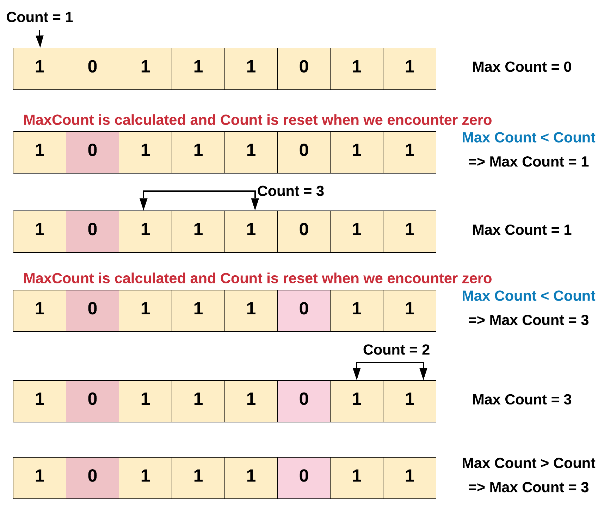

# Max Consecutive Ones

Given a binary array `nums`, return _the maximum number of consecutive _`1`_'s in the array_.

 

**Example 1:**

```
Input: nums = [1,1,0,1,1,1]
Output: 3
Explanation: The first two digits or the last three digits are consecutive 1s. The maximum number of consecutive 1s is 3.
```

**Example 2:**

```
Input: nums = [1,0,1,1,0,1]
Output: 2
```

 

**Constraints:**

- `1 <= nums.length <= 105`
- `nums[i]` is either `0` or `1`.

## Approach 


The intuition is pretty simple. We keep a count of the number of 1's encountered. And reset the count whenever we encounter anything other than 1 (which is 0 for this problem). Thus, maintaining count of 1's between zeros or rather maintaining counts of contiguous 1's. It's the same as keeping a track of the number of hours of sleep you had, without waking up in between.

Algorithm

Maintain a counter for the number of 1's.

Increment the counter by 1, whenever you encounter a 1.

Whenever you encounter a 0

a. Use the current count of 1's to find the maximum contiguous 1's till now.

b. Afterwards, reset the counter for 1's to 0.

Return the maximum in the end.



In the above diagram we found out that the maximum number of consecutive 1's is 3. There were two breaks in the count we encountered while iterating the array. Every time the break i.e. 0 was encountered we had to reset the count of 1 to zero.


## Solution

```python

    def findMaxConsecutiveOnes(self, nums: List[int]) -> int:
        
        count = maxCount = 0
        
        
        for num in nums:
            if num == 1:
                count += 1            
            else:
                maxCount = max(maxCount,count)
                count = 0
                
                
        return max(maxCount,count)

```