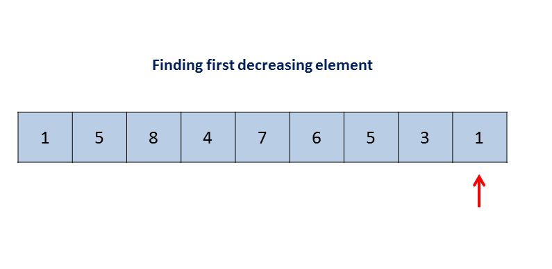

# Next Permutation

A **permutation** of an array of integers is an arrangement of its members into a sequence or linear order.

- For example, for `arr = [1,2,3]`, the following are all the permutations of `arr`: `[1,2,3], [1,3,2], [2, 1, 3], [2, 3, 1], [3,1,2], [3,2,1]`.

The **next permutation** of an array of integers is the next lexicographically greater permutation of its integer. More formally, if all the permutations of the array are sorted in one container according to their lexicographical order, then the **next permutation** of that array is the permutation that follows it in the sorted container. If such arrangement is not possible, the array must be rearranged as the lowest possible order (i.e., sorted in ascending order).

- For example, the next permutation of `arr = [1,2,3]` is `[1,3,2]`.
- Similarly, the next permutation of `arr = [2,3,1]` is `[3,1,2]`.
- While the next permutation of `arr = [3,2,1]` is `[1,2,3]` because `[3,2,1]` does not have a lexicographical larger rearrangement.

Given an array of integers `nums`, _find the next permutation of_ `nums`.

The replacement must be **[in place](http://en.wikipedia.org/wiki/In-place_algorithm)** and use only constant extra memory.

 

**Example 1:**

```
Input: nums = [1,2,3]
Output: [1,3,2]
```

**Example 2:**

```
Input: nums = [3,2,1]
Output: [1,2,3]
```

**Example 3:**

```
Input: nums = [1,1,5]
Output: [1,5,1]
```

 

**Constraints:**

- `1 <= nums.length <= 100`
- `0 <= nums[i] <= 100`

## Approach 

one pass

* Take two pointers i and j to track swaping numbers
* check for decsending number by comparing `nums[i-1] >= nums[i]`
* if i == 0: return reversed, reason all are des numbers
* find k as asc number using `nums[k] <= nums[j]`
* swap k and j
* sort values after k + 1



## Solution

```python
# O(n) | O(1)
class Solution:
    def nextPermutation(self, nums: List[int]) -> None:
        """
        Do not return anything, modify nums in-place instead.
        """
        
        i = j = len(nums) - 1        
        
        while i > 0 and nums[i-1] >= nums[i]:
            i -= 1
        
        if i == 0:
            nums.reverse()
            return
        k = i - 1
        
        while nums[j] <= nums[k]:
            j -= 1
        
        nums[k],nums[j] = nums[j],nums[k]
        
        l,r = k+1,len(nums)-1
        
        while l < r:
            nums[l],nums[r] = nums[r],nums[l]
            l += 1
            r -= 1

```


<iframe width="1066" height="608" src="https://www.youtube.com/embed/6qXO72FkqwM" title="Next Permutation | Leetcode #31" frameborder="0" allow="accelerometer; autoplay; clipboard-write; encrypted-media; gyroscope; picture-in-picture" allowfullscreen></iframe>