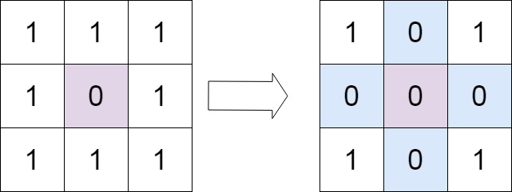
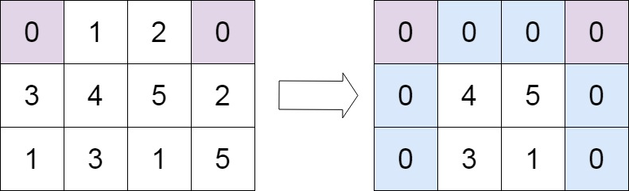

# Set Matrix Zeroes

Given an m x n integer matrix matrix, if an element is 0, set its entire row and column to 0's.

You must do it in place.

 

Example 1:


Input: matrix = [[1,1,1],[1,0,1],[1,1,1]]
Output: [[1,0,1],[0,0,0],[1,0,1]]
Example 2:


Input: matrix = [[0,1,2,0],[3,4,5,2],[1,3,1,5]]
Output: [[0,0,0,0],[0,4,5,0],[0,3,1,0]]
 

Constraints:

m == matrix.length
n == matrix[0].length
1 <= m, n <= 200
-231 <= matrix[i][j] <= 231 - 1
 

Follow up:

A straightforward solution using O(mn) space is probably a bad idea.
A simple improvement uses O(m + n) space, but still not the best solution.
Could you devise a constant space solution?


## Approach

* find all the zeros and store in an array
* perform dfs and update the values


## Solution

```python
class Solution:
    def setZeroes(self, matrix: List[List[int]]) -> None:
        """
        Do not return anything, modify matrix in-place instead.
        """
        
        ROWS,COLS = len(matrix),len(matrix[0])
        
        
        def dfs(r,c):
            for row in range(r+1,ROWS):
                matrix[row][c] = 0
            
            for row in range(r):
                matrix[row][c] = 0
                
            for col in range(c+1,COLS):
                matrix[r][col] = 0
                
            for col in range(c):
                matrix[r][col] = 0
            
        zeros = []
        
        
        
        for r in range(ROWS):
            for c in range(COLS):         
                if matrix[r][c] == 0:
                    zeros.append((r,c))
                    
                    
        while zeros:
            row,col =  zeros.pop()
            dfs(row,col)
        
                    
                    
        return matrix

```